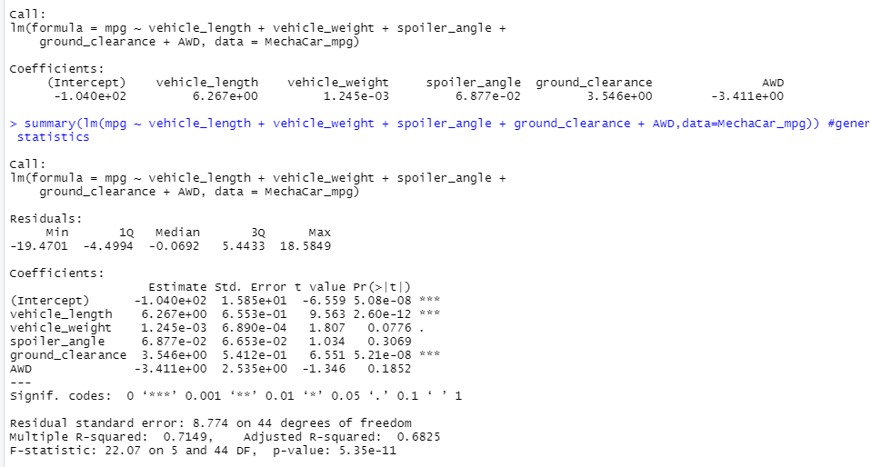
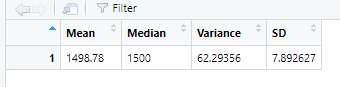
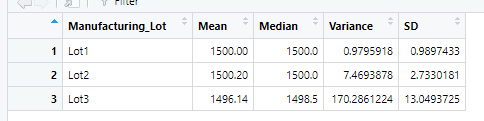
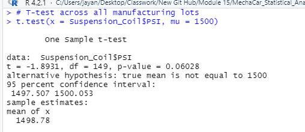
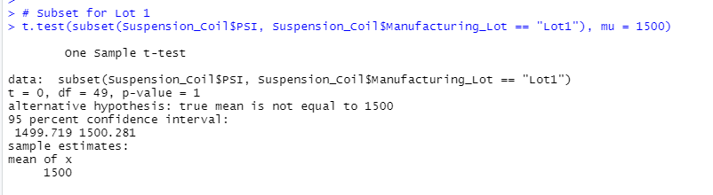
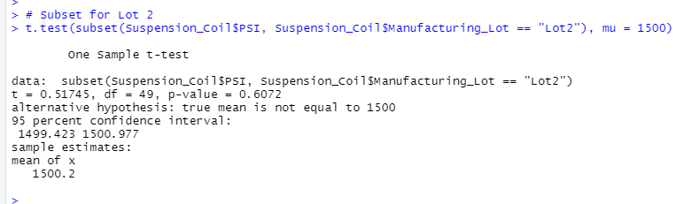

# MechaCar_Statistical_Analysis

## Linear Regression to Predict MPG

Based on the linear regression analysis, vehicle_length and ground_clearance both provided a non-random amount of variance to the mpg values in the dataset at the 0.05% significance level. In other words, vehicle_length and ground_clearance are likely to have a significant impact on mpg. 

With a p-value of 5.35e-11, there is sufficient evidence to reject our null hypothesis, which means that the slope of our linear model is not zero. 

The r-squared value is 0.7149, which means that roughly 71% of the variablilty of our dependent variable (mpg) is explained using this linear regression model. This means our model is moderately effective in predicting the mpg of MechaCar prototypes.

## Summary Statistics on Suspension Coils

Our total summary shows that as a whole, variance of the suspension coil PSI is about 62 lbs per square inch, which meets the design specifications of no more than 100 lbs per square inch.

However, our lot summary shows that the variance of one lot greatly exceeds the design specifications. Lot 3 has a variance of about 170 lbs per square inch, almost twice the maximum. Lot 1 and 2 fall well within specifications with about 1 lb per square inch and 7 lbs per square inch of variance respectively.

## T-Tests on Suspension Coils

When comparing all manufacturing lots to the mean population PSI of 1500, the t-test p-value is 0.06028. This suggests there is not enough evidence to reject the null hypothestis at the 0.05% confidence level. The mean PSI of the given manufacturing lots all together is statistically similar to the mean PSI of the population.

When testing lot 1 and 2 individually, the t-test has p-values of 1 and 0.6072 respectively. Again, there is not sufficient evidence to reject the null hypothesis and the mean PSI of each of these lots is statistically similar to the mean PSI of the population.

 

However, when testing lot 3 individually, the t-test has a p-value of 0.04168. This is lower than our significance level of 0.05%, so we have sufficient evidence to reject the null hypothesis. This suggests that mean PSI of lot 3 (1496.14) is statistically different than that of the population. In practical terms, Lot 3 may actually be different from most suspension coils produced by MechaCar, and needs further investigation.

## Study Design: MechaCar vs Competition

Some features of a car that might be of interest to a consumer include: cost, fuel efficency, horsepower, torque, engine type, safety rating, size/space, reliability rating, and maintenance costs.

A potential study might compare long term maintenance costs of each MechaCar vehicle with a care from a similar class for other major brands. For example, a study would follow a set of 50 Mechacar sedan owners over the course of 5 years from their purchase of a 2020 car, logging their maintenance costs and determining a metric, 5-year maintenance cost.

It would also collect similar data from 50 sedan owners from each 4 of MechaCars major competitors (for example: Toyota, Hyundai, Ford, Honda), for a car in the same class. This would be 200 additional cars total.

Before testing, we would do summary statistics (mean, median, variance, standard deviation) on the 5-year maintenance cost for all 250 cars, for each subset of cars by manufacturer, and for all the competitors cars combined. 

The null hypothesis would be that the mean 5-year maintenance cost of the MechaCar sedan is not statistically different from the mean 5-year maintenance cost of the sedans of the same class from major competitors. 

The alternative hypothesis would be that the mean 5-year maintenance cost of the MechaCar sedan is statistically different from the mean 5-year maintenance cost of the sedans of the same class from major competitors. 

Because we are comparing the means of two samples, a  two-sample t-test would be used to test the null hypothesis, with the first sample being the 50 MechaCar sedans and the second sample being the other 200 cars. 

Alternatively, we could perform two-sample t-tests between the MechaCar sample and each competitor individually. 

If the 5-year maintenance costs for MechaCar sedans are significantly different, we can then compare means to see if they under or over perform compared to competitors and make adjustments accordingly. 

